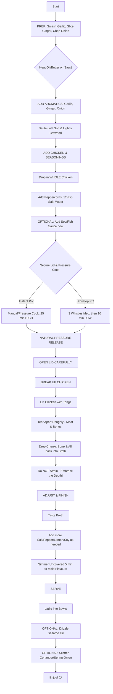

This is an excellent recipe that prioritises flavour and depth to a truly comforting and restorative soup. 

1. **Whole Chicken:** Using a whole chicken is the best approach for a rich broth. The bones provide collagen, which gives the soup body and a silky mouthfeel. The skin and fat render down to provide _schmaltz_ (chicken fat), which carries an immense amount of flavour.
1. **Aromatic Base:** Sautéing the garlic, ginger, and onion first is a critical step. This process, known as the Maillard reaction, creates complex, browned flavours that form the savoury foundation of the soup. Skipping this and just boiling everything together would result in a much flatter taste.
1. **Pressure Cooking:** This is an efficient method for flavour extraction. It forces liquid into the chicken and breaks down connective tissues quickly, essentially achieving in 30-40 minutes what would take several hours of gentle simmering on a stovetop.
1. **"Unclear" Broth:** The instruction to not strain the soup and to return the broken-up chicken (bones and all) to the pot is the key to its flavour-rich character. The tiny suspended particles of protein, fat, and marrow are what make the soup feel so substantial and nourishing. A clear consommé is elegant, but an opaque, rustic broth is often more comforting.
1. **Finishing Touches:** The optional additions are well-chosen.
-- **Umami:** Soy or fish sauce adds a deep, savoury (umami) note that complements the chicken perfectly.
-- **Acidity:** A squeeze of lemon or a dash of vinegar at the end is a professional technique. It doesn't make the soup taste sour; instead, it brightens all the other flavours and cuts through the richness of the fat, making the soup feel less heavy.
-- **Aromatics:** Toasted sesame oil and fresh herbs (coriander/spring onions) are added at the very end because their volatile aromas would be lost during cooking. They provide a fresh, fragrant top note that contrasts beautifully with the deep, slow-cooked broth.

### Step-by-Step Guide

**Hearty & Flavourful Chicken Soup: Guide**

This guide will walk you through making a deeply comforting chicken soup where flavour is the star. Don't worry about making it look perfect!

**Ingredients**

- 1 whole chicken (about 1.2–1.5 kg)
- 10 large garlic cloves
- A thick, thumb-sized piece of ginger (about 2 inches)
- 1 medium onion
- 1 tbsp neutral oil (like sunflower or rapeseed) or butter
- 8 black peppercorns
- 1½ tsp salt (you will add more later)
- 2½ litres of water (or enough to nearly submerge the chicken)
- **For finishing (optional but highly recommended):**
-- 1 tsp light soy sauce
-- A squeeze of fresh lemon juice
-- A few drops of toasted sesame oil
-- A handful of finely chopped fresh coriander or spring onions

**Method**

**Step 1: Prepare Your Ingredients (Mise en Place)** This is the most important step to ensure a smooth cooking process.

- Peel the onion and chop it into large, rough chunks.
- Peel the 10 garlic cloves and smash them lightly with the flat side of a knife.
- Peel the ginger and slice it into a few thick coins.
- Have your chicken, salt, peppercorns, and oil ready next to the cooker.

**Step 2: Build the Flavour Base**

- Place your pressure cooker pot on the stove or plug in your Instant Pot.
- Select the 'Sauté' function and let it heat up for a minute.
- Add the 1 tbsp of oil or butter. Once it's shimmering, add the chopped onion, smashed garlic, and sliced ginger.
- Stir occasionally for about 3-4 minutes. You want them to soften and turn slightly golden at the edges. They will smell wonderfully fragrant.

**Step 3: Combine and Seal**

- Turn off the 'Sauté' function.
- Carefully place the whole chicken into the pot, on top of the aromatics.
- Add the black peppercorns, 1½ tsp of salt, and the optional soy sauce.
- Pour in the water. It should come up the sides of the chicken, almost covering it completely. Don't overfill past the max line of your cooker.
- Secure the lid on your pressure cooker.

**Step 4: Pressure Cook**

- **For an Instant Pot:** Make sure the steam valve is set to 'Sealing'. Select 'Manual' or 'Pressure Cook' and set the timer for 25 minutes on High Pressure.
- **For a stovetop pressure cooker:** Place it on medium-high heat. Wait for it to come to full pressure (the first whistle). Then, reduce the heat to medium-low and cook for about 20 minutes (or follow your cooker's instructions, aiming for 3-4 whistles in total).
- Once the cooking time is up, **turn off the heat** and let the pressure release naturally. This means you do nothing and just wait for the pressure pin/indicator to drop on its own. This can take 15-20 minutes but results in more tender meat.

**Step 5: Shred the Chicken**

- Once the pressure has fully released, carefully open the lid, letting the steam escape away from your face.
- The chicken will be extremely tender and may already be falling apart. Use a pair of tongs to carefully lift the chicken out of the broth and place it onto a large plate or in a bowl. It will be very hot.
- Let it cool for about 10 minutes, or until you can handle it.
- Using two forks (or your hands), pull the meat off the bones. You can shred it into bite-sized pieces.
- Return all the shredded meat back into the broth in the pot. For maximum flavour, you can even put some of the smaller bones back in.

**Step 6: Final Seasoning and Simmer**

- Bring the soup back to a gentle simmer on a low heat (you can use the 'Sauté' function again on low). Let it bubble gently for 5 minutes to allow the flavours to meld together.
- Now, taste the broth. This is where you perfect it.
-- Is it salty enough? Add more salt, a pinch at a time.
-- Does it taste a bit flat? Add a small squeeze of lemon juice to brighten it.
-- Want more depth? Add another splash of soy sauce.
- Stir and taste again until it's just right for you.

**Step 7: Serve**

- Ladle the hot soup, full of chicken pieces and broth, into bowls.
- Just before serving, drizzle each bowl with a few drops of toasted sesame oil and sprinkle with fresh coriander or spring onions. Enjoy your deeply comforting and flavourful soup!

🍲 Unclear but Flavour-Rich Chicken Soup Flowchart 🍲
(For Depth, Warmth & Comfort - Not Clarity!)
🎯 Goal: Deeply Savoury, Warming & Soothing Soup 🎯
🛒 Ingredients Checkpoint:
 * 🍗 1 Whole Chicken (1.2-1.5kg) - The Star!
 * 🧄 10 Garlic Cloves (smashed)
 * 🧅 1 Onion (roughly chopped)
 * 🫚 1 Thick Thumb Ginger (sliced/crushed)
 * ⚫ 8 Black Peppercorns
 * 🧂 1½ tsp Salt (to start)
 * 💧 2½ L Water (or to submerge)
 * 🧴 1 tbsp Oil/Butter (for flavour base)
✨ Optional Flavour Boosters (Add at stages indicated):
 * 🥢 1 tsp Light Soy/Fish Sauce (Step 3)
 * 🍋 Small Squeeze Lemon/Vinegar (Step 5)
 * 🌰 Few drops Toasted Sesame Oil (Step 6)
 * 🌿 Chopped Coriander/Spring Onions (Step 6)
🚀 Method (Pressure Cooker / Instant Pot Flow) 🚀

Texture & Flavour Profile:
✨ Deeply Savoury | 🔥 Warming | 😌 Soothing
 * Expect fat droplets & unstrained bits - these are flavour bombs!
If you'd like an actual image that visualizes these steps, just let me know!

