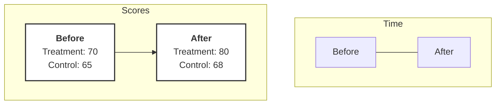

## The Difference-in-differences Method: Isolating an Effect in a Changing World

Imagine you're the mayor of a city, and you've launched an innovative after-school tutoring program in one specific school, let's call it "School A." Your goal is to improve math scores. A year later, you check the results. The average math score at School A has gone up by 10 points.

A success, right? Time to roll out the program city-wide?

Well, maybe. But a skeptical voice in your head might ask: "How do we know the scores went up _because_ of our program?" What if this was just a particularly good year for math students everywhere? What if a new, more engaging curriculum was adopted by the whole district? Or maybe the students are just a year older and naturally better at math.

The world doesn't stand still just because we run an experiment. Things are always changing. So the core challenge becomes: how do we disentangle the effect of our program from all the other changes happening in the background?

### The Problem: Chasing a Moving Target

Let's visualize this. On a simple chart, we can plot the average math score at School A before and after the program.

```
          |
  Score   |
          |
    80 ---|-----------------● (After)
          |                /
          |               /
    70 ---|----● (Before)  /
          |  /
          └--------------------
              Time →
```

![[did_diagram.pdf]]

We see a clear increase. This is the **first difference**: the change in score for our treated school over time.

$$
 \Delta_{\text{Treatment}} = \text{Score}_{\text{A, After}} - \text{Score}_{\text{A, Before}} = 80 - 70 = 10 
$$

But this 10-point gain mixes two things together:

1. The true effect of our tutoring program.
2. The general trend of how scores would have changed anyway.

If we could somehow know what would have happened to School A _without_ the program, we could just subtract that from the observed outcome. This "what-if" scenario is what we call the **counterfactual**. It's the path not taken.

But we can't go back in time and _not_ give School A the program. The counterfactual is, by its nature, unobservable. So, what can we do?

### The Solution: Finding a Mirror

Here's the beautiful idea. What if we could find another school, let's call it "School B," that is very similar to School A but _did not_ get the new tutoring program? This is our **control group**.

The key insight is that School B can serve as a proxy for the counterfactual. By tracking how School B's scores change over the same period, we get a measurement of that background "time trend" that was clouding our results.

Let's say School B's scores also changed.

- School B Score (Before): 65
- School B Score (After): 68

So, even without any program, the scores at a similar school went up by 3 points.

$$
 \Delta_{\text{Control}} = \text{Score}_{\text{B, After}} - \text{Score}_{\text{B, Before}} = 68 - 65 = 3 
$$

This 3-point increase is our best guess for the natural change over time that would have affected _any_ school, including School A.

Now we have two differences. The first was the change in our treatment group (10 points). The second is the change in our control group (3 points).

The true effect of our program can be estimated by taking the **difference of these two differences**.

$$
 \text{Estimated Effect} = \Delta_{\text{Treatment}} - \Delta_{\text{Control}} 
$$

$$
 \text{Estimated Effect} = 10 - 3 = 7 
$$

So, our tutoring program likely caused a 7-point increase in math scores. The other 3 points were just the "tide rising" for everyone.

### Visualizing the Counterfactual

This becomes incredibly clear when we plot all four points on a graph.

>Imagine a 2D plane with Time on the x-axis (Before, After) and Score on the y-axis.
>
>1.  Plot two blue dots for the **Treatment Group (School A)**: one at `(Before, 70)` and one at `(After, 80)`. Draw a solid blue line connecting them. The slope of this line represents the observed change, `+10`.
>2.  Now, plot two red dots for the **Control Group (School B)**: one at `(Before, 65)` and one at `(After, 68)`. Draw a solid red line connecting them. The slope of this line represents the time trend, `+3`.



Now for the magic. The control group's trend tells us what would have happened to the treatment group in the absence of the treatment.

>On the graph, find the starting point of the Treatment group `(Before, 70)`. From there, draw a _dashed blue line_ that runs perfectly parallel to the Control group's red line.

Where does this dashed line end up at the "After" time point? It started at 70 and we expect it to go up by the time trend of 3, so it ends at 73. This point, `(After, 73)`, is our estimated **counterfactual**. It's our picture of the world that wasn't.

Our treatment group _actually_ ended up at 80. The gap between where it _did_ end up (80) and where it _would have_ ended up (73) is the effect of the treatment.

$$
 \text{Effect} = \text{Actual Outcome} - \text{Counterfactual Outcome} 
$$

$$
 \text{Effect} = 80 - 73 = 7 
$$

This vertical distance on the graph _is_ the Difference-in-Differences estimate. It's the difference between the two differences.

### The All-important Assumption: Parallel Trends

For this to work, we have to make one crucial assumption. We are assuming that, in the absence of the tutoring program, the trends in scores for School A and School B would have been **parallel**.

We can't ever prove this is true during the treatment period—that's the counterfactual we can't observe. But we can look for evidence. If we have data from several years _before_ the program was introduced, we can plot the trends for both schools.

>Imagine extending the timeline backwards. If the lines for School A and School B move up and down together, more or less in parallel, for several years before our experiment, it gives us confidence that School B is a good control for School A. If the lines are diverging or doing completely different things, then our assumption is on shaky ground.

This "Parallel Trends Assumption" is the heart and soul of the Difference-in-Differences method.

### From Intuition to Formalism

This intuitive idea has an elegant mathematical representation, often estimated using a [[Linear Regression]].

Let's define a few variables:

- $Y_{it}$ is the outcome (math score) for school $i$ at time $t$.
- $\text{Treat}_i$ is a dummy variable that is 1 if school $i$ is in the treatment group (School A) and 0 if it's in the control group (School B).
- $\text{Post}_t$ is a dummy variable that is 1 for the "after" period and 0 for the "before" period.

We can model the score with the following equation:

$$
 Y_{it} = \beta_0 + \beta_1 \cdot \text{Treat}_i + \beta_2 \cdot \text{Post}_t + \beta_3 \cdot (\text{Treat}_i \times \text{Post}_t) + \epsilon_{it} 
$$

This looks complex, but it's just a precise way of describing our four data points. Let's see what the expected score is for each group by plugging in 0s and 1s.

- **Control Group, Before Period** ($\text{Treat}=0, \text{Post}=0$):  
  $ E[Y] = \beta_0 $

- **Control Group, After Period** ($\text{Treat}=0, \text{Post}=1$):  
  $ E[Y] = \beta_0 + \beta_2 $

  >The change for the control group is $(\beta_0 + \beta_2) - \beta_0 = \beta_2$. So, $\beta_2$ represents the time trend.

- **Treatment Group, Before Period** ($\text{Treat}=1, \text{Post}=0$):  
  $ E[Y] = \beta_0 + \beta_1 $

  >The initial difference between the groups is $(\beta_0 + \beta_1) - \beta_0 = \beta_1$. So, $\beta_1$ is the baseline difference.

- **Treatment Group, After Period** ($\text{Treat}=1, \text{Post}=1$):  
  $ E[Y] = \beta_0 + \beta_1 + \beta_2 + \beta_3 $

Now, let's re-calculate the Difference-in-Differences using these terms.

1. **Change for Treatment Group**:  
   $(\text{Treat, After}) - (\text{Treat, Before}) = (\beta_0 + \beta_1 + \beta_2 + \beta_3) - (\beta_0 + \beta_1) = \beta_2 + \beta_3$

2. **Change for Control Group**:  
   $(\text{Control, After}) - (\text{Control, Before}) = (\beta_0 + \beta_2) - (\beta_0) = \beta_2$

3. **The Difference in Differences**:  
   $(\text{Change for Treat}) - (\text{Change for Control}) = (\beta_2 + \beta_3) - (\beta_2) = \beta_3$

The coefficient on the interaction term, $\beta_3$, _is_ the Difference-in-Differences estimate. It's the additional change over time experienced only by the treatment group. It isolates the effect beautifully.

By using a simple control group, we've managed to build a window into an alternate reality, allowing us to see what would have happened and, in doing so, separate the effect of our intervention from the relentless flow of time.

Difference in Difference

  - Difference in differences aka Add a control!
  - Suppose effect of education reforms on math scores
    - Scores pre & post reform
    - Problem: change naturally over time
  - DID: changes post and pre in Treatment against a control (e.g. a school with no reform or a random subset)
  - If Ctrl scores go up too -> $[Treatment - Control]$
    - Control is the counterfactual -> What if no reform?

Related notes:
