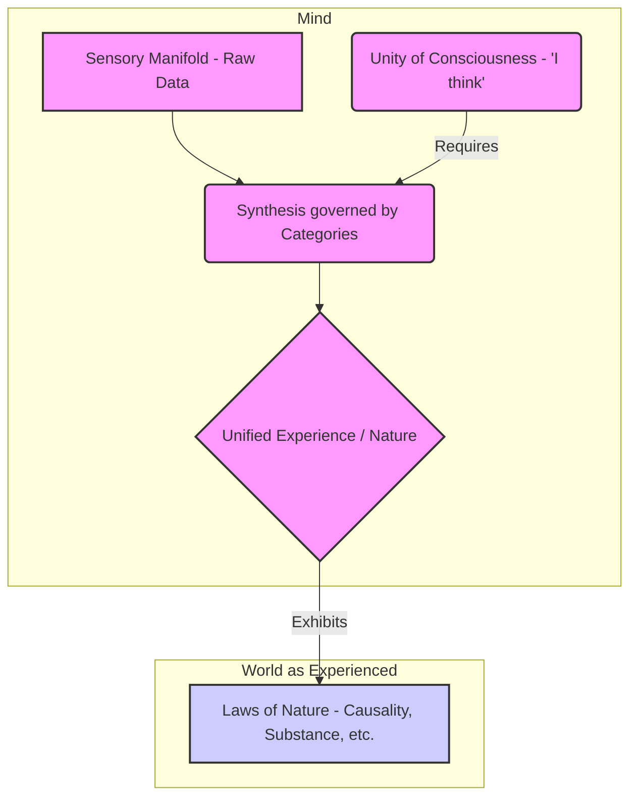

Alright, let's dive into one of the most formidable and rewarding peaks in the landscape of Western thought: Immanuel Kant's _Critique of Pure Reason_. This isn't just _a_ book; many consider it _the_ pivotal work of modern philosophy. Our guide for this initial exploration is Robert Paul Wolff, whose lectures, particularly those drawing from his own deep engagement with Kant in works like _Kant's Theory of Mental Activity_, offer a pathway into this dense territory.

We'll primarily be referencing the Norman Kemp Smith translation, though awareness of others, like the Paul Guyer version, and crucially, the original German, is helpful for deeper study. You'll often hear references to the "A edition" (1781) and the "B edition" (1787) of the _Critique_. These aren't just minor revisions; Kant made significant changes, and understanding the differences is key to navigating the scholarly landscape surrounding the text.

Now, tackling the _Critique_ is famously challenging. It's dense, intricate, and at times, seems internally contradictory. This isn't a text you simply read; it's a text you wrestle with. Think of the parable of the butcher versus the analytic philosopher trying to carve a chicken. The philosopher, focused on surface logic, might make neat, arbitrary cuts. The butcher, however, understands the underlying structure – the joints, the bones, the way the creature is put together – and carves accordingly, efficiently and meaningfully. Reading Kant requires a similar approach. We need to look beyond the surface arguments and grasp the deep, underlying architecture of his thought. This requires interpretation, an effort to reconstruct the most coherent and powerful argument embedded within the text, even if Kant himself occasionally fumbles the presentation. Philosophy isn't math; there isn't always a single right answer, and multiple compelling interpretations can coexist. We're aiming to unearth _a_ powerful, coherent reading.

Who was this thinker who constructed such an edifice? Immanuel Kant, born in 1724 in Konigsberg, Prussia (now Kaliningrad, Russia). His upbringing was marked by Pietism, a Lutheran sect emphasizing inner conviction and morality. He studied at the University of Konigsberg, notably under Martin Knutzen, who introduced him to the dominant philosophical system of the time: the rationalism of Gottfried Wilhelm Leibniz, as systematized by Christian Wolff. Kant spent years as a private tutor before becoming a lecturer (_Privatdozent_) and eventually a professor.

For much of his early career, Kant worked broadly within that Leibnizian-Wolffian framework. However, a significant shift occurred around 1770 with his Inaugural Dissertation, _On the Form and Principles of the Sensible and the Intelligible World_. Here, Kant began to diverge, drawing sharper distinctions between the way we perceive the world through our senses and how we might conceive of it through pure intellect. This marked his initial break from the idea that reason alone could grasp the ultimate nature of reality.

But the truly seismic shift was yet to come. Around 1772, Kant encountered the work of the Scottish empiricist David Hume. Kant famously wrote that reading Hume "interrupted my dogmatic slumber." He had initially planned a relatively straightforward critique of reason's powers, likely an extension of his 1770 ideas. But Hume's radical skepticism, particularly concerning cause and effect, forced Kant to confront a much deeper problem. Hume argued that we never actually _perceive_ a necessary connection between events; we just see one thing follow another repeatedly and develop a habit of expecting it. If Hume was right, then the very possibility of scientific knowledge, which relies on universal causal laws, seemed threatened. This encounter sent Kant back to the drawing board for nearly a decade of intense thought, culminating in the 1781 publication of the _Critique of Pure Reason_.

To appreciate Kant's project, we need to understand the philosophical landscape he inherited. It was dominated by two major, overlapping debates:

1. **The Leibniz vs. Newton Debate:** This was fundamentally about metaphysics and the nature of the physical world. What are space and time? Are they absolute containers, existing independently of objects (Newton's view, space as "God's sensorium"), or are they relational, arising from the connections _between_ fundamental substances (Leibniz's view, space as relations between monads)? What is the ultimate nature of substance?
2. **The Rationalists vs. Empiricists Debate:** This was about epistemology – the theory of knowledge. Where does genuine knowledge come from?
	- **Rationalists** (like Descartes, Leibniz): Argued that true knowledge comes from reason, innate ideas, and logical deduction. Sense experience was seen as often misleading. Think of mathematical truths – they seem certain and independent of any specific observation.
	- **Empiricists** (like Locke, Berkeley, Hume): Argued that all knowledge originates in sense experience. The mind starts as a "blank slate" (_tabula rasa_), and experience writes upon it.

Kant's genius was to see a way _through_ these entrenched oppositions. He didn't simply side with one camp. Instead, he proposed a revolutionary synthesis. In a way, he suggested both sides were partially right, but operating on different levels.

He introduced a crucial distinction:

- **Phenomena:** Things as they _appear_ to us, structured by our minds. This is the world of experience, the world science investigates.
- **Noumena:** Things as they might be _in themselves_, independent of our minds and how we perceive them.

Kant's move, especially after the 1770 dissertation and amplified by the encounter with Hume, was to argue that we can _never_ have direct knowledge of noumena, of things-in-themselves. The old metaphysical ambition of rationalism – to grasp ultimate reality through pure reason – was deemed impossible.

So, where did that leave knowledge? Kant turned his attention to the realm of phenomena. His central question became: How is it possible to have knowledge of appearances that is nonetheless _necessary_ and _universal_? Think of Newtonian physics – it seemed to offer universal laws (like gravity) that applied everywhere and always. But if all knowledge comes from experience (as empiricists claimed), how could we ever arrive at such universal certainty? Experience only gives us particulars.

This is where Hume's challenge became critical. Hume's skepticism didn't just question our knowledge of ultimate reality; it questioned the very possibility of necessary connections _even within the realm of appearances_. If causality is just a habit of mind, then the laws of science are built on sand.

Kant's response was radical, often called his "Copernican Revolution" in philosophy. Just as Copernicus proposed that the Earth revolves around the Sun (not vice-versa) to better explain celestial movements, Kant proposed that _objects must conform to our knowledge_ rather than our knowledge simply conforming to objects.

What does this mean? Kant argued that our minds are not passive receivers of sensory information. Instead, the mind actively _structures_ our experience using innate frameworks. These structures are not derived _from_ experience; they are the preconditions _for_ having any coherent experience at all.

Think of it like wearing irremovable glasses. Everything you see is shaped by the lenses. You can't take them off to see the "raw" world, but you _can_ study the properties of the glasses themselves to understand _why_ the world appears as it does.

For Kant, the fundamental "lenses" include:
- **Forms of Sensibility:** Space and Time. These are not properties of things-in-themselves but the necessary framework within which we perceive _anything_ externally (space) or internally (time).
- **Pure Concepts of the Understanding (Categories):** These are fundamental concepts like causality, substance, unity, plurality, necessity, etc. They are not learned from experience but are the rules the mind uses to organize sensory input into meaningful judgments and coherent objects.

The _Critique of Pure Reason_ is essentially Kant's attempt to identify and justify these _a priori_ (prior to experience) structures of the mind. He aimed to show that because these structures are necessary for _any possible experience_, the principles based on them (like "every event has a cause") are necessarily true _of the world as we experience it_ (phenomena). This is how he sought to answer Hume and provide a firm foundation for scientific knowledge, while simultaneously acknowledging the limits of reason regarding things-in-themselves.

The argument for the validity of these categories, particularly the section known as the **Transcendental Deduction of the Pure Concepts of the Understanding**, is notoriously complex and central to the entire project. It's the engine room of the _Critique_. Wolff describes his own work in _Kant's Theory of Mental Activity_ as an attempt to reconstruct the logical steps of this deduction, wrestling it into a coherent argument. Kant's method here is often dialectical: he starts from a point he believes cannot be denied – essentially, the unity of self-consciousness, the "I think" that must be able to accompany all my representations – and argues step-by-step that the categories (including causality) are necessary conditions for this unity of consciousness itself. If you accept the starting point, he argues, you must accept the validity of the categories for structuring experience.

We must also remember the two editions. The 1781 (A) edition and the significantly revised 1787 (B) edition present the arguments, especially the Deduction, differently. Some scholars, including Wolff, suggest that some of Kant's revisions in the B edition, perhaps in response to early criticisms, actually obscure or even misrepresent the core thrust of his original, more radical insight. Navigating these differences is part of the interpretive challenge.

In essence, Kant's _Critique_ redraws the map of knowledge. It limits the scope of pure reason in metaphysics but simultaneously secures the foundations of empirical science by grounding its necessary principles not in the external world itself, but in the unavoidable structure of the human mind that experiences that world. He sought to establish the legitimacy of concepts like causality _within_ the bounds of possible experience, thereby answering Hume's skepticism about phenomena, while conceding to skepticism regarding noumena.

This work fundamentally transformed the philosophical conversation, effectively ending the old debates between rationalism and empiricism in their prior forms and setting the stage for much of 19th and 20th-century philosophy.

For our next step, we'll need to look closely at the Prefaces and the Introduction to the _Critique_ itself. There, Kant lays out his project, defines key terms, and sets the stage for the intricate arguments to follow, including some of those potentially problematic B edition revisions.

Okay, let's delve into the intricate world of Immanuel Kant's _Critique of Pure Reason_. Imagine philosophy before Kant. Thinkers were largely divided: some, the Rationalists, believed reason alone could unlock the deepest truths about reality, much like deriving geometric theorems. Others, the Empiricists, argued that all knowledge fundamentally comes from sensory experience – we learn by observing the world. It felt like a stalemate.

Then comes Kant, stepping onto this stage not just to take a side, but to reshape the entire conversation. His project, the _Critique of Pure Reason_, isn't just another philosophical argument; it's an attempt by reason to investigate _itself_. \[Visual: Imagine a sophisticated measuring instrument being used to measure its own accuracy, or an eye trying to perceive itself directly.] This is the essence of "Critique" in Kant's title – a rigorous, impartial examination of reason's own powers and, crucially, its limits. He lived in the Enlightenment, an era demanding that everything, even cherished beliefs about religion or law, stand before the "tribunal of reason." Kant applies this principle to reason itself.

And what about "Pure Reason"? This signals a focus shift. For centuries, metaphysics aimed to understand the ultimate nature of reality – God, freedom, immortality. But philosophers like Descartes, Locke, Berkeley, and especially Hume had increasingly turned the spotlight inward, questioning how we _know_ anything at all. This is the "epistemological turn." Kant pushes this further. "Pure" reason refers to the faculty of reason operating _independently_ of any particular sensory experience. He wants to understand the very structure of our cognitive faculties – what must be true about our minds _before_ we even have our first experience?

To grasp Kant's project, we need to understand two fundamental distinctions he makes about judgments, which are essentially statements of knowledge.

First, the distinction between _a priori_ and _a posteriori_ knowledge.
- **_A posteriori_ knowledge** is empirical – it comes _after_ or _from_ experience. "The sun is hot" is _a posteriori_; you need to experience the sun's heat (or rely on others' experience) to know it. \[Visual: A timeline showing 'Experience' happening, then 'Knowledge' derived.\]
- **_A priori_ knowledge**, on the other hand, is independent of experience. Think of logical truths like "All bachelors are unmarried." You don't need to survey bachelors; you know this by understanding the definitions of the words. It's known _before_ or _independently of_ specific experiences. \[Visual: Knowledge existing conceptually, separate from the timeline of experience.\]

Second, the distinction between _analytic_ and _synthetic_ judgments.
- An **_analytic_ judgment** is one where the predicate concept is already contained within the subject concept. "All bachelors are unmarried" is analytic because the concept 'unmarried' is part of the definition of 'bachelor'. These judgments clarify concepts but don't add genuinely new information. \[Visual: A box labelled 'Bachelor' with 'Unmarried' inside it. The judgment just points out what's already in the box.\]
- A **_synthetic_ judgment** is one where the predicate concept adds something new, something not contained in the subject concept. "The cat is on the mat" is synthetic. The concept 'being on the mat' isn't part of the definition of 'cat'. These judgments _synthesize_ different concepts to create new information, typically based on experience. \[Visual: Two separate concepts, 'Cat' and 'On the mat', being linked together by the judgment.\]

Now, let's combine these. We can visualize a 2x2 grid:

```markdown
        +--------------------------+---------------------------+
        |                          | A Priori (Independent of Exp.) | A Posteriori (From Exp.)  |
        +--------------------------+---------------------------+---------------------------+
        | Analytic (Concept contains Pred.) | All bachelors unmarried. | (Generally considered empty) |
        |                          | (Logical truths)         |                           |
        +--------------------------+---------------------------+---------------------------+
        | Synthetic (Pred. adds new info) | ???                       | The cat is on the mat.    |
        |                          | (Kant's crucial category) | (Empirical knowledge)     |
        +--------------------------+---------------------------+---------------------------+
```

Before Kant, it was generally assumed that _a priori_ knowledge had to be analytic (like logic), and synthetic knowledge had to be _a posteriori_ (like science). The controversial, revolutionary heart of Kant's project lies in that top-right quadrant: he argues for the existence and vital importance of **synthetic _a priori_ judgments**.

These would be statements that give us genuinely new information about the world (synthetic) but are known with certainty _independently_ of any particular experience (_a priori_). Where could such knowledge possibly come from?

Kant points to mathematics. Consider "7 + 5 = 12". He argues this is _synthetic_. The concept '12' isn't contained merely within the concepts '7', '5', and 'addition'. You need to perform an act of synthesis, an intuition (perhaps counting on fingers in your mind), to arrive at 12. Yet, it's also _a priori_. We know 7 + 5 = 12 with universal certainty, not by conducting experiments adding groups of objects. Geometry, for Kant, was another prime example – propositions about space seemed to describe the world synthetically, yet were known _a priori_. \[Visual: Show 7 dots and 5 dots, then a mental action combining them into 12 dots. Contrast this with simply analyzing the definition of '7+5'.\]

This claim about synthetic _a priori_ knowledge is a major driver for the entire _Critique_. If such knowledge exists, _how_ is it possible? Answering this requires dissecting the machinery of the mind. Kant proposes two fundamental faculties of cognition:

1. **Sensibility:** This is our capacity to receive representations through the way we are affected by objects. It's the source of our _intuitions_ – the raw, immediate data of experience. Think of it as the mind's sensory input channel.
2. **Understanding:** This is our faculty for thinking objects through _concepts_. It takes the raw data from sensibility and organizes it, categorizes it, applies rules to it. Think of it as the mind's processing unit, applying conceptual frameworks.

Crucially, Kant argues that knowledge arises _only_ from the union of these two. "Thoughts without content are empty, intuitions without concepts are blind." Sensibility provides the 'stuff' of knowledge, understanding provides the structure. \[Visual: Two streams, 'Sensibility (Intuitions)' and 'Understanding (Concepts)', merging into a river labeled 'Knowledge'.\]

So, how does this relate to synthetic _a priori_ knowledge? Kant's radical idea is that our cognitive faculties themselves impose a certain structure on _any possible experience_. Sensibility doesn't just passively receive data; it structures it through the _a priori_ forms of intuition: **Space** and **Time**. Understanding doesn't just find patterns; it actively imposes _a priori_ concepts (the Categories) to organize intuitions into coherent judgments.

This investigation into the _a priori_ conditions necessary for any experience whatsoever is what Kant calls **transcendental** inquiry. It's not knowledge _of_ objects, but knowledge about _how we must be constituted to be able to know objects at all_. \[Visual: Someone wearing special glasses. Transcendental inquiry isn't about the objects seen, but about the structure of the glasses themselves that makes seeing possible.]

When you open the _Critique_, its structure can seem daunting. Kant uses multiple overlapping organizational schemes: the Doctrine of Elements vs. Method; the Analytic (logic of truth) vs. Dialectic (logic of illusion); a grand "architectonic" plan based on cognitive faculties; and echoes of traditional logic (concepts, judgments, syllogisms). It's complex!

However, a key thread running through it, especially evident if we look closely at passages like one in the first edition preface (A XVI), is the idea of **synthesis**. Kant distinguishes between an "objective deduction" (justifying the _validity_ of our _a priori_ concepts) and a "subjective deduction" (explaining the cognitive faculties _themselves_ and how they make experience possible). While he initially downplayed the subjective deduction, it's arguably the engine of the whole work. It explains _how_ the mind actively combines sensory input with its own conceptual structures – the process of synthesis – to construct our experienced reality. This synthesis is the mechanism behind synthetic _a priori_ judgments.

In the second edition's introduction, Kant famously poses four questions:
1. How is pure mathematics possible?
2. How is pure natural science possible?
3. How is metaphysics possible as a natural disposition? (Why do we inevitably ask metaphysical questions?)
4. How is metaphysics possible as a science? (Can it achieve genuine knowledge?)

While these questions frame the project, it's perhaps misleading to see the _Critique_ as simply _providing answers_ to pre-existing possibilities. Rather, the deep dive into sensibility and understanding is meant to _demonstrate_ how mathematics and natural science _are_ possible (because of the mind's _a priori_ structures) and to determine _whether_ metaphysics as a science is possible (Kant's answer will ultimately be quite critical).

So, as we prepare to look deeper, particularly into the _Transcendental Aesthetic_ (Kant's theory of sensibility, space, and time), remember the core mission: Reason is turning inward to map its own territory, its powers, and its boundaries. Kant is arguing that our minds are not passive mirrors reflecting an independent reality, but active constructors, imposing _a priori_ structures (like space, time, and fundamental concepts) that make experience and knowledge possible in the first place. The existence of synthetic _a priori_ judgments, particularly in mathematics, is his key piece of evidence that this construction is taking place. The journey through the _Critique_ is an exploration of the blueprints of our own understanding.

Okay, let's explore the intricate landscape of Immanuel Kant's thought, particularly the foundations he lays in the _Critique of Pure Reason_. Imagine philosophy before Kant as a debate between two main camps. On one side, the **Rationalists**, like Leibniz, believed that pure reason, independent of experience, could unlock fundamental truths about reality. On the other, the **Empiricists**, like Hume, argued that all knowledge ultimately stems from sensory experience. Kant enters this scene not just to take a side, but to fundamentally reshape the questions being asked.

Consider Leibniz's fascinating principle: the **Identity of Indiscernibles**. It suggests that if you can't find any difference in the properties of two things, they must be the same thing. Sounds reasonable, right? But Kant presents a wonderfully intuitive counterexample: your left and right hands.

```markdown
      LEFT HAND             RIGHT HAND
      _______               _______
     / _____ \             / _____ \
    / /     \ \           / /     \ \
   | |       | |         | |       | |
   | |       | |         | |       | |
   \ \_______/ /         \ \_______/ /
    \ _______ /           \ _______ /
     \| | | |/             \| | | |/
      `-----'               `-----'
   (Thumb on left)       (Thumb on right)
```

Imagine describing every internal spatial relation within your left hand – the distances between fingertips, the angles of the joints. Now do the same for your right hand. You'll find the descriptions are identical, mirror images. Yet, try as you might within our familiar three dimensions, you cannot perfectly superimpose one onto the other. Place your left glove on your right hand – it doesn't fit correctly. Kant uses this idea of _incongruent counterparts_ to argue that space isn't just a set of relations _derived_ from objects, as Leibniz might imply. Instead, space seems to be a fundamental structure, a pre-existing framework _within which_ objects are situated. This hints that our perception isn't just passively receiving data; it involves an intuitive grasp of this spatial structure.

Now, let's turn to Hume. Hume had brilliantly shown that concepts like causality aren't directly observed in experience. We see one billiard ball hit another, and then the second one moves. We infer a necessary connection, but we don't _see_ the necessity itself. Hume attributed this inference to mental habits or "propensities." Kant found this insightful but incomplete. He agreed that experience alone doesn't give us concepts like causality or substance, but he wasn't satisfied with mere psychological habit. He saw these fundamental concepts, which he would later call **Categories**, as necessary structures of the _understanding_ itself, structures required to make sense of experience at all. He wanted to provide a more robust foundation than Hume's propensities, grounding them in the very possibility of knowledge.

This leads us to the heart of Kant's project in the first part of the _Critique_, the **Transcendental Aesthetic**. He starts by drawing a crucial line between two faculties of the mind:

1. **Sensibility**: This is our capacity to _receive_ representations by being affected by objects. It's fundamentally receptive, passive. Think of it as the mind's antenna, picking up signals from the world.
2. **Understanding**: This is our capacity to _think_ about objects through concepts. It's active, organising, and unifying the raw data received through sensibility. Think of it as the processor that interprets the signals.

The Transcendental Aesthetic focuses entirely on **Sensibility**. Kant asks: are there any structures inherent to sensibility itself, structures that shape _how_ we receive data even before the understanding gets involved? His answer is a resounding yes: **Space** and **Time**.

These are not concepts derived from experience (like 'dog' or 'chair'), nor are they properties of things as they exist independently of us (things-in-themselves). Instead, Space and Time are the **pure forms of intuition**. They are like the pre-installed operating system of our sensibility.

- **Space** is the form of our _outer_ sense – the structure through which we perceive objects as outside ourselves and alongside each other.
- **Time** is the form of our _inner_ sense – the structure through which we perceive our own mental states and, indeed, all appearances sequentially.

Think of it like wearing a pair of special glasses. You can't take them off. Everything you see is necessarily structured spatially, and every experience unfolds temporally. These aren't features of the world _out there_ in some absolute sense; they are the conditions under which anything can appear _to us_ at all.

Kant contrasts our human intuition, which is **passive** or _receptive_ (we need objects to affect us), with a hypothetical **divine intuition**, which he imagines as _active_ or _creative_. A divine intellect wouldn't need to perceive an existing world; its thinking would _create_ the objects themselves. Our intuition, however, depends on being given something through sensation.

Within our passive intuition, Kant distinguishes the **form** from the **matter**.
- **Matter**: The specific sensations – the colours, sounds, textures, tastes. This is what is _given_ empirically, or _a posteriori_. Think of the pixels on a screen.
- **Form**: Space and Time – the structure within which these sensations are arranged. This structure is inherent to our sensibility, it's there _a priori_, before any specific experience. Think of the grid or coordinate system of the screen itself.

This distinction echoes a shift in the scientific revolution, moving away from explaining the world through inherent qualities (like 'heat' as a substance) towards describing it through mathematical relationships in space and time.

Now, why is this framework of space and time so important? It provides Kant's answer to a profound question: How is **synthetic _a priori_** knowledge possible?

Let's break that down:
- _A priori_ knowledge is known independently of experience (e.g., "All bachelors are unmarried").
- _A posteriori_ knowledge is known through experience (e.g., "This swan is white").
- _Analytic_ judgments merely clarify the concept (e.g., "Bachelors are unmarried" – 'unmarried' is part of the definition of 'bachelor'). They don't add new information.
- _Synthetic_ judgments add new information not contained in the concept (e.g., "This swan is white" – 'white' isn't part of the definition of 'swan').

Hume essentially argued that all _a priori_ knowledge must be analytic, and all _synthetic_ knowledge must be _a posteriori_. Kant disagrees, pointing to mathematics, especially **geometry**, as a prime example of knowledge that is both _synthetic_ (it tells us something new about its concepts) and _a priori_ (we know its truths with certainty without needing to measure every possible triangle).

Consider the proposition: "The sum of angles in a triangle is 180 degrees." Is this analytic? Kant argues no. The concept of 'triangle' (a three-sided figure) doesn't, just by definition, contain the concept of '180 degrees'. We need to do something more. Or consider: "The shortest distance between two points is a straight line." The concept 'straight line' signifies a quality, while 'shortest distance' signifies a quantity. Again, not merely analytic.

How do we know these geometrical truths? Kant says we **construct** them in **pure intuition**. We access the _form_ of our intuition – space – stripped of any particular sensory content. Imagine drawing a triangle, not on paper, but in your mind's eye, focusing only on the spatial structure itself.

```markdown
       / \
      / _ \  <-- We construct this in pure spatial intuition
     / ___ \
    /_______ \
```

By manipulating this pure spatial form, we can arrive at necessary truths about all possible spatial figures. When we prove something about one triangle constructed this way, how can we be sure it applies to _all_ triangles? Because the construction wasn't based on the properties of a _particular_ empirical triangle, but on the universal structure of space itself, the _a priori_ form of our outer intuition. We are essentially exploring the necessary features of our own spatial 'operating system'.

This underlying structure, this framework of spatial and temporal relations considered in itself, apart from any specific sensation filling it, is what Kant refers to as the **manifold of intuition**. It's the pure potential for ordering appearances. Geometry, for Kant, explores the structure of this spatial manifold. It's synthetic because the constructions reveal properties not contained in the mere definitions, and it's _a priori_ because it deals with the necessary form of our sensibility, not contingent empirical content.

Interestingly, while the _Transcendental Aesthetic_ often emphasizes space (especially using geometry as its key example), Kant increasingly highlights **time** as the more fundamental form of intuition as the _Critique_ progresses. Time, as the form of _inner_ sense, applies to _all_ our experiences, both outer (objects in space) and inner (our thoughts and feelings), as they all occur sequentially within our consciousness.

Kant also briefly opens a fascinating door: could other rational beings exist with entirely different **forms of intuition**? Perhaps they don't perceive things in three spatial dimensions and one temporal dimension. Maybe their 'sensibility glasses' are entirely different. This implies that our spatio-temporal framework, while necessary _for us_, might not be a universal feature of all possible consciousness. This thought would later fuel discussions about the potential historical or cultural relativity of perception.

Now, how does this framework impact our understanding of ourselves? Descartes famously argued "Cogito, ergo sum" ("I think, therefore I am"), suggesting direct, immediate access to our own thinking substance. Kant challenges this. He argues that even self-knowledge is subject to the forms of intuition. We are aware of ourselves _through_ **inner sense**, whose form is **time**. Therefore, we don't access a naked 'self' as it might be 'in itself'. We only know ourselves _as we appear to ourselves_ over time – a sequence of thoughts, feelings, and perceptions. Our self-knowledge is mediated, just like our knowledge of external objects. It's not a privileged, direct insight into our ultimate nature.

This leads to a crucial Kantian distinction: **Appearance vs. Thing-in-itself**. Everything we experience through sensibility, structured by space and time, belongs to the realm of **appearances** (phenomena). The world _as it appears to us_. What things might be like independent of our forms of intuition – **things-in-themselves** (noumena) – remains fundamentally unknowable to us through theoretical reason.

Within the realm of appearances, however, we can still make important distinctions. Kant differentiates between the **empirically real** and the **empirically ideal**. An oasis you see in the desert might be **empirically real** if it coheres with other possible experiences (you can walk to it, drink the water, etc.). A mirage of an oasis, however, is **empirically ideal** – it's an appearance, but one that doesn't fit consistently into the rule-governed structure of experience. Both the real oasis and the mirage are still _appearances_, structured by space and time. Neither is the thing-in-itself.

```markdown
+-----------------------------------+
| Realm of the Unknowable           |
|        (Things-in-themselves)     | <--- Beyond our cognitive reach
+-----------------------------------+
             ^
             | Filtered by Mind's Structure
             v
+-----------------------------------+
| Realm of Appearance (Phenomena)   |
|   (Structured by Space & Time)    |
|                                   |
|   +---------------------------+   |
|   | Empirically Real          |   | (Consistent, lawful experiences)
|   | (e.g., actual oasis)      |   |
|   +---------------------------+   |
|   +---------------------------+   |
|   | Empirically Ideal         |   | (Illusions, dreams, mirages)
|   | (e.g., mirage of oasis)   |   |
|   +---------------------------+   |
+-----------------------------------+
```

Kant argues that attempts by previous philosophers (like Leibniz) to gain knowledge about things-in-themselves (e.g., the ultimate nature of the soul, the world as a whole, or God) through pure reason alone are doomed to fail. These attempts lead to what he calls **Transcendental Illusions**. It's not just that they happen to be wrong; they represent a fundamental misuse of reason, trying to apply concepts beyond the bounds of possible experience, beyond the realm structured by our sensibility. It's like trying to use a ruler to measure the concept of justice – the tool is simply not suited for the task.

So, the Transcendental Aesthetic establishes the crucial role of sensibility and its _a priori_ forms, space and time. It grounds the possibility of synthetic _a priori_ knowledge in mathematics and sets the stage for understanding the limits of our cognition. We have this structured input from sensibility, this manifold of intuition. But raw, structured intuition isn't yet knowledge. We need the other faculty, the **Understanding**, to apply concepts, to unify this manifold, to make judgments. This process of unification, of bringing intuitions under concepts, is what Kant calls **synthesis**, and it will be the central focus as we move into the next part of the _Critique_: the **Transcendental Logic**.

Okay, let's dive into the intricate world Kant builds in his _Critique of Pure Reason_. We're venturing into a section he calls the "Transcendental Analytic," and specifically, the "Analytic of Concepts." Now, Kant is a grand systematizer, much like architects who design not just a single room, but an entire, sprawling edifice. His goal is ambitious: to map the very structure of human understanding and how it connects to the world.

Think about what constitutes knowledge. Kant proposes, right at the outset, that it springs from two fundamental, yet distinct, sources within us.

First, there's **Receptivity**. This is our capacity to _receive_ impressions, to be affected by the world. Think of it as the raw data streaming in through our senses. This gives us what Kant calls **Intuitions**. It's the immediate, sensory 'this-ness' of experience – the greenness of the grass, the warmth of the sun.

Second, there's **Spontaneity**. This is our mind's active role, its ability to _produce_ representations itself, to organize and structure the raw data it receives. This faculty gives rise to **Concepts**. Concepts are the rules, the organising principles, the mental boxes we use to sort and understand intuitions. 'Green', 'Warm', 'Sun', 'Grass' – these are concepts that allow us to make sense of the raw sensory input.

Kant crystallizes this dual requirement in one of his most famous lines:

>"Thoughts without content are empty, intuitions without concepts are blind."

Let's unpack that. "Thoughts without content are empty." Imagine thinking about sophisticated concepts – say, advanced physics or intricate logical structures – but without any connection to observation or experience. These thoughts might be internally consistent, but they don't tell us anything about the actual world. They lack grounding, substance.

Consider Tolkien's _Middle-Earth_. It's a conceptually rich, incredibly detailed world. We have concepts like 'Hobbit', 'Orc', 'Mordor'. But no matter how elaborate these concepts are, they remain 'empty' in the sense that they don't correspond to anything we can actually perceive or interact with in our reality. We lack the intuitions – the sensory data – that would make Middle-Earth knowledge _of_ a real place.

Now, the other side: "Intuitions without concepts are blind." Imagine being flooded with raw sensory data – colours, sounds, textures – but without any conceptual framework to organize it. It would be, as William James later described it, a "blooming, buzzing confusion." You wouldn't be able to distinguish objects, identify patterns, or make sense of the scene. The intuitions are there, the raw data is flowing in, but without concepts to structure it, it's unintelligible, 'blind'. You couldn't form knowledge _from_ it.

So, for Kant, genuine knowledge – knowledge that tells us something meaningful about the world we experience – absolutely requires _both_ ingredients: the raw material of sensation (intuitions) and the active structuring by the mind (concepts).

Now, Kant uses the term **Transcendental** quite a bit. It sounds lofty, maybe even mystical, but its meaning here is quite specific and technical. Transcendental knowledge, for Kant, isn't knowledge _of_ some higher, mystical realm. Instead, it's knowledge concerning _how knowledge itself is possible_ in the first place, specifically, how _a priori_ knowledge – knowledge independent of any particular experience – is possible. He's investigating the built-in structures of the mind that shape all our possible experience. Think of it like studying the rules of grammar that make meaningful sentences possible, rather than just analyzing one particular sentence. Kant is after the universal grammar of understanding.

How does the mind apply these structuring concepts? Kant believes one key way is through making **Judgements**. When we think, we connect concepts together in judgements like "The sun is warm," or "All humans are mortal." He thinks that if we can map out all the fundamental logical _forms_ of judgement, we might get a clue about the fundamental _concepts_ the mind uses to structure experience.

He proposes a systematic classification of all possible logical forms of judgement, organised under four main headings:

**Table of the Logical Functions of Unity in Judgements**

1. **Quantity**
	- _Universal_: All S are P (e.g., All swans are white)
	- _Particular_: Some S are P (e.g., Some swans are black)
	- _Singular_: This S is P (e.g., This swan is Cygnus)

2. **Quality**
	- _Affirmative_: S is P (e.g., The soul is mortal)
	- _Negative_: S is not P (e.g., The soul is not mortal)
	- _Infinite_: S is non-P (e.g., The soul is non-mortal - placing it in the infinite class of non-mortal things)

3. **Relation**
	- _Categorical_: S is P (e.g., The body is heavy)
	- _Hypothetical_: If P, then Q (e.g., If there is perfect justice, the wicked are punished)
	- _Disjunctive_: S is P or Q (e.g., The world exists either through blind chance or inner necessity)

4. **Modality**
	- _Problematic_: S may be P (Possible) (e.g., This judgement might be true)
	- _Assertoric_: S is P (Actual) (e.g., This judgement is true)
	- _Apodictic_: S must be P (Necessary) (e.g., This judgement must be true)

Kant believed this table exhaustively covered the ways our intellect can combine concepts into judgements. There are $3 \times 4 = 12$ basic forms here.

Now comes a crucial, and somewhat controversial, step. Kant wants to find the fundamental concepts – the **Categories** – through which the mind structures _experience itself_. These Categories are the pure concepts of the understanding that apply _a priori_ to objects of intuition. Where do these fundamental concepts come from?

Kant introduces the idea of **Synthesis**. Imagine synthesis as the active process of the mind _combining_ different representations, taking the manifold of intuition – that raw stream of sensory data – and unifying it according to certain rules. It's the act of 'putting together'. Think of watching a movie: you receive a rapid sequence of still frames and distinct sounds (the manifold), but your mind synthesizes this into a continuous flow of action, objects, and dialogue – a unified experience. Synthesis is this unifying act.

Kant's bold move, sometimes called the "Metaphysical Deduction," is to propose that the fundamental ways the mind performs this synthesis – the pure concepts or Categories – directly correspond to the logical functions of unity in judgement we just saw. He argues that the very same functions that structure our _judgements_ about objects also structure our _experience_ of those objects.

He lays out a **Table of Categories**, mirroring the Table of Judgements:

**Table of Categories**

1. **Of Quantity**
	- _Unity_ (corresponding to Singular Judgement)
	- _Plurality_ (corresponding to Particular Judgement)
	- _Totality_ (corresponding to Universal Judgement)

2. **Of Quality**
	- _Reality_ (corresponding to Affirmative Judgement)
	- _Negation_ (corresponding to Negative Judgement)
	- _Limitation_ (corresponding to Infinite Judgement)

3. **Of Relation**
	- _Of Inherence and Subsistence_ (`substantia et accidens`) (Substance/Accident) (corresponding to Categorical Judgement)
	- _Of Causality and Dependence_ (`cause and effect`) (corresponding to Hypothetical Judgement)
	- _Of Community_ (`reciprocity between agent and patient`) (corresponding to Disjunctive Judgement)

4. **Of Modality**
	- _Possibility – Impossibility_ (corresponding to Problematic Judgement)
	- _Existence – Non-existence_ (corresponding to Assertoric Judgement)

So, the idea is: the way we logically structure the judgement "If P then Q" (Hypothetical) reflects a fundamental way our understanding structures experience itself, namely through the concept of Cause and Effect. The way we judge "This S is P" (Singular) reflects the concept of Unity, and so on.

Now, it's worth noting that many philosophers find this direct derivation of the Categories from the forms of judgement a bit too neat, perhaps even a weak link in Kant's grand argument. It feels somewhat like Kant had the Categories in mind already (perhaps influenced by Aristotle and the philosophical tradition) and reverse-engineered the connection to his Table of Judgements. The argument here, in this specific section, isn't as watertight as others Kant makes.

However, _don't let this perceived weakness obscure the bigger picture_. The crucial takeaway isn't necessarily _this specific derivation_, but rather the profound idea that our mind imposes a fundamental conceptual structure – the Categories – onto the raw data of sensation in order to produce unified, objective experience. The problem Kant is tackling is immense: how do we get from a chaotic influx of sensations to the stable, ordered world of objects, causes, and effects that we all experience? This is the problem of the "unity of the manifold," a challenge that deeply concerned philosophers like David Hume as well.

The Categories – concepts like Substance, Causality, Unity, Reality – are Kant's answer. They are the _a priori_ rules of synthesis, the conceptual toolkit the understanding uses to build a coherent world out of sensory fragments.

While the argument _linking_ the Judgement table to the Category table might feel shaky to some, Kant provides much more robust arguments for the _necessity_ of the Categories themselves later in the _Critique_, particularly in the section called the "Transcendental Deduction" (often split into 'subjective' and 'objective' parts). That's where he'll truly grapple with _how_ and _why_ these specific concepts are indispensable conditions for the very possibility of self-conscious experience.

Especially important will be his argument for the Category of Causality – the Causal Maxim, that every event necessarily has a cause. This stands as one of Kant's most significant and enduring contributions, offering a direct response to Hume's skepticism about our knowledge of causal connections.

So, what we've seen here is the groundwork. Kant establishes the need for both intuition and concepts, defines his 'transcendental' project, maps the forms of logical judgement, and introduces the Categories as the fundamental concepts the mind uses to synthesize experience, proposing a link between the two tables. We've noted the potential weakness in that specific link, but recognized the profound importance of the underlying problem – the unification of experience – and the role the Categories are meant to play. The real heavy lifting, the deep justification for _why_ experience _must_ be structured by these Categories, is still to come. We've laid out the blueprint; the structural proofs are next.

Okay, let's delve into the intricate machinery behind our conscious experience, guided by the insights of Immanuel Kant. How is it that the world doesn't just appear to us as a chaotic flood of disconnected sensations, a buzzing confusion of light, sound, and touch? How do we perceive stable objects, unified events, and a coherent reality?

Think about what happens when you perceive something simple, like a sentence being spoken. It unfolds over time, word by word. Yet, you grasp it as a single, meaningful whole. Imagine if different people heard each word separately – would _anyone_ understand the sentence? Likely not. The comprehension lies in the unification of those sequential parts within a single awareness. This hints at a fundamental challenge: our minds are constantly bombarded by a _manifold_ of representations – fleeting sensations, memories, ideas. What binds them together?

This puzzle sits at the heart of Kant's project in the _Critique of Pure Reason_. He takes inspiration, perhaps surprisingly, from Descartes' famous "Cogito ergo sum" – "I think, therefore I am." But Kant subtly reframes it. For Kant, the crucial insight isn't just _that_ I think, but that the awareness expressed by "I think" must, in principle, be capable of accompanying _all_ of my representations. If I sense 'red', then 'round', then 'rolling', I must be able to recognize that it is the _same_ 'I' who is experiencing all these different facets, potentially belonging to a single object like a rolling red ball. There's a unity to my consciousness that allows me to own all these disparate mental states.

How is this unity achieved? If experience starts as this potentially disconnected manifold, how does it become the unified stream we consciously live through? Kant's answer is a process he calls **synthesis**. Synthesis is the act of putting together, of combining different representations and recognizing their connection within a single consciousness. It's the mind actively _structuring_ its input, not just passively receiving it. Think of it like weaving individual threads (sensations, ideas) into a coherent fabric (conscious experience).

```markdown
Manifold (Input):      ------->   Mind's Activity   ------->   Unified Experience (Output)
\[red\] \[round\] \[smooth\]               (Synthesis)                \[This is a red ball\]
\[sound1\] \[sound2\]                    (Synthesis)                \[That is a melody\]
\[thought A\] \[thought B\]              (Synthesis)                \[A coherent argument\]
```

But this act of synthesis cannot be arbitrary or chaotic. If the mind just randomly mashed representations together, we wouldn't get a stable, predictable world. There must be rules guiding this process. This leads to a profound reinterpretation of what a concept _is_. For Kant, concepts are not just static labels for things; they are fundamentally **rules** for carrying out this synthesis.

Consider what it means for an activity to be rule-governed. Think about playing chess. The rules of chess – how the knight moves, what constitutes checkmate – don't just regulate the game; they _define_ it. Moving a knight like a bishop isn't just a mistake; it's _not playing chess_. The rules precede the activity, determine what counts _as_ the activity, and provide the standard by which we judge actions within the activity as correct or incorrect.

```markdown
Activity: Chess
Rule:     Knight moves in an 'L' shape.
Action:   Move Knight diagonally.
Judgment: Incorrect (Not part of the 'chess' activity as defined by the rule).
```

Or imagine constructing a building according to an architect's blueprint. The blueprint acts as the rule. Only the actions that conform to the plan – placing this beam here, using these materials – count as part of the _construction_ activity as intended. Anything else – admiring the view, chatting with colleagues – is external to the rule-governed process itself. Similarly, a musician performing a piece follows the score; the notes and rhythms are the rules defining that specific musical performance. We judge the performance based on its adherence to these rules.

Kant's radical idea is that our fundamental understanding of the world operates similarly. The most basic ways we structure experience – thinking in terms of cause and effect, substance and accident, unity, plurality – are governed by innate rules. These fundamental rules of synthesis are what Kant calls the **Categories**. They are the mind's non-negotiable blueprints for assembling a coherent reality from the raw manifold of sensibility. They are the rules that must be followed for _any_ synthesis to occur, making unified experience – and thus, the possibility of the "I think" accompanying all representations – possible.

So, the Categories aren't things we deduce _from_ experience; they are the rules that make experience, as we know it, possible in the first place. They provide the necessary structure, the essential connections, that transform the potential chaos of the manifold into the unified world we perceive.

It's helpful here to briefly touch upon a nuance in Kant's language, often debated in translation. He distinguishes between "Objective Reality" (Objektive Realität) and "Objective Validity" (Objektive Gültigkeit). While related, think of it like this:
- **Objective Reality:** Does this concept relate to _some_ possible object of experience? Does it have purchase on the world we can perceive? (e.g., The concept 'unicorn' might lack objective reality if unicorns cannot be objects of our experience).
- **Objective Validity:** Is a specific _judgment_ using this concept true of an object? (e.g., The judgment 'That horse is white' has objective validity if the horse I'm referring to is indeed white).  
The Categories, for Kant, must have Objective Reality because they are the very conditions under which objects can be given to us in experience at all.

This view of concepts as rules, specifically the Categories as the fundamental rules of synthesis, has profound implications. If these Categories are the rules by which _our minds_ structure _our experience_ (phenomena), it raises questions about their applicability to things as they might be independent of our minds – what Kant calls "things-in-themselves" or noumena. If our understanding is structured by these rules, can we truly grasp a reality _outside_ of that structure? This creates a tension, particularly for Kant's later attempts to ground concepts like freedom, which seem to operate outside the deterministic rules (like causality) that structure our phenomenal world.

The argument, then, isn't simply that we _have_ categories, but that the very possibility of a unified self-consciousness ("I think") capable of spanning diverse representations _demands_ an active synthesis, and this synthesis must operate according to fundamental rules – the Categories. They are the conclusion of an argument about the conditions necessary for unified experience, not arbitrary starting points.

Our next step will be to look more closely at the mechanics of this synthesis itself. Kant describes a "threefold synthesis" and introduces the concept of "schematism" to bridge the gap between the pure, abstract Categories and the concrete data of sensibility. How exactly does the mind apply these universal rules to the particular sensations it receives? That's the journey ahead.

Okay, let's explore how our minds take the chaotic flood of raw sensation and somehow construct the stable, coherent world we experience every day. How does the buzz of photons hitting our retinas become the _recognition_ of a familiar face? How do vibrations in the air become a _melody_ we can follow?

Last time, we touched on a fundamental idea: underlying all our thoughts, all our representations of the world, there must be a unified awareness, this constant background hum of "I think." This isn't just one thought among others; it's the condition that makes _any_ thought possible for _me_. We also saw that concepts aren't just labels; they act as _rules_ for organizing our experience, like a blueprint for assembling sensations. And the _activity_ of using these rules to bring together the raw data of our senses – what Kant calls the manifold of sensibility – is _synthesis_. Categories, then, are the most fundamental set of these rules, the master blueprints the mind uses.

So, what exactly _is_ this synthesis? Think of it as the mind actively _reproducing_ the sensory input it receives, but not randomly. It does so in a structured, _rule-governed_ way, using the faculty we call imagination. It's like weaving individual threads (sensations) into a coherent tapestry (experience) according to a specific pattern (the rule, or category). Our focus now is to unpack what this weaving process truly entails.

Kant walks us through this with what's called the "subjective deduction," breaking down synthesis into three intertwined movements: apprehension in intuition, reproduction in imagination, and recognition in a concept.

It's crucial here to remember the distinction between _receptivity_ – how we passively receive sensory data through sensibility – and _spontaneity_ – how our understanding actively structures that data. Synthesis is the engine of spontaneity.

**Stage 1: Apprehension in Intuition – The Role of Time**

First, consider how sensations even arrive. They don't just appear fully formed and organized. There's an initial gathering, an _apprehension_. Kant argues that this initial intake is fundamentally ordered by **Time**.

Now, you might think of time, like space, as just a container where things happen. But Kant elevates Time to something more profound in the _Critique_. While his earlier thoughts might have leaned more on space for understanding the physical world, here Time becomes the bedrock of our inner experience.

Imagine raw sensory data flooding in. Kant suggests that while it might have an inherent spatial quality (we perceive things _next_ to each other), it's the mind itself that imposes a _temporal_ sequence. It does this through a process sometimes called "self-affection" – the mind, in the act of perceiving, affects its own inner state, stringing sensations out along the line of time.

Think of it like frames of a movie film. Each frame might contain spatial information, but it's only when they are run sequentially _in time_ that motion and narrative emerge.

```markdown
Sensory Input --> \[Mind imposes Time Sequence\] --> Perception 1 -> Perception 2 -> Perception 3 -> …
   (Raw Data)        (Inner Sense / Self-Affection)         (Ordered flow in consciousness)
```

This has a striking consequence. The mind doesn't grasp its perceptions raw, as they might hypothetically exist before this ordering. It only knows them _as they appear_ through this temporal structuring. This directly challenges Descartes' idea that we have privileged, direct access to our own thoughts. Even our inner world is mediated, structured by this fundamental form of Time.

**Stage 2: Reproduction in Imagination – Connecting the Dots**

Okay, so sensations are apprehended sequentially in time. But experience isn't just a stream of disconnected moments. We perceive enduring objects, recognize patterns, follow melodies. How? This requires the second movement: _reproduction in imagination_.

Imagination here isn't about making things up. It's the faculty that allows the mind to _bring back_ or _re-present_ past perceptions and connect them with the present one. Crucially, this isn't a haphazard recall. It must be _rule-governed_. To experience a melody, you need to hold the previous notes in mind and anticipate the next, according to the melodic rule or pattern. To see a house, you don't just apprehend disconnected patches of colour; you reproduce the sequence of perceptions (walking around it, seeing different sides) and unify them according to the concept 'house'.

```markdown
Time Sequence: P1 -> P2 -> P3 -> P4 -> …
Imagination:   Holds P1 while P2 occurs, holds P1&P2 while P3 occurs…
               …following a RULE that links P1, P2, P3…
```

Kant connects this to what psychologists call the empirical law of association – the tendency for certain perceptions to call others to mind. But he elevates this. It's not just a psychological quirk; it's a _transcendental_ necessity. For consciousness to even be possible, for the "I think" to unify experience, our perceptions _must_ be reproducible in an orderly way. If experiences didn't follow reproducible patterns, if they were utterly chaotic, consciousness couldn't latch onto them; experience itself would fragment.

There's an echo here, perhaps, of something like an anthropic principle: the universe we experience _must_ have a degree of regularity, must exhibit patterns, precisely because our minds _require_ such patterns to perform the synthesis necessary for coherent consciousness. The possibility of experience presupposes a certain amenability of the world to our rules of synthesis.

**Stage 3: Recognition in a Concept – Knowing the Rule**

We apprehend sensations in time, and we reproduce them according to rules. But there's a final, crucial step: _recognition in a concept_. We must be _aware_ of the rule we are applying.

Think about counting. You apprehend one dot, then another, then another. You reproduce the sequence. But to _count_ them, you need to recognize that each step involves applying the _same rule_ – adding one. You need the _concept_ of unity, and the concept of succession, and the concept of the sum generated by repeatedly applying the "+1" rule. You recognize the _unity_ of the action of synthesis itself.

```markdown
Sequence: P1 -> P2 -> P3 -> P4
Rule:     Connect P1..P4 according to Rule 'R'
Recognition: Awareness that 'R' is the rule unifying P1..P4 --> Concept 'C' applied
                                                            |
                                                            V
                                                   Judgment: "This is C"
```

This recognition is what allows us to move from a mere sequence of associated perceptions to a unified _object_ of experience, grasped under a concept. It's the moment the blueprint isn't just _used_, but _understood_. This is the basis for forming judgments – "This is a house," "The sun warms the stone."

**So, What is an "Object"?**

This leads Kant to a profound question: If all we ever directly access are our own representations, structured by our minds, what do we even mean when we talk about an "object"? It seems we _don't_ mean some mysterious thing-in-itself existing completely independently of our minds, which we somehow magically access. Appearances _are_ the objects, as structured by our minds.

Kant introduces the idea of a "transcendental object = X". This is a tricky concept, representing the _thought_ of something in general that corresponds to our perceptions, the unknown ground or correlate outside of our sensibility that the understanding relates our representations to. But it's not something we can _know_. It signifies the objectivity _required_ by the unity of our thought, the idea that our representations aren't just a random personal dream but relate to _something_.

However, the _empirical object_ – the table, the chair, the planet – isn't this unknowable X. The empirical object _is_ the rule-governed unity _in_ our representations. It's what emerges _through_ the three-fold synthesis. We know objects not by somehow peeling away our perceptions, but precisely _through_ the judgments we make, which rely on the conceptual rules (categories) that unify those perceptions. An object isn't just a bundle of sense-data; it's the _conceptual unity_ that dictates how those sense-data must be connected according to a rule.

**The Grand Unification: Consciousness and Nature**

Here's where Kant makes his most radical move. The very unity of consciousness – the fact that the "I think" must be able potentially to accompany _all_ my representations – _demands_ this thoroughgoing, rule-governed synthesis. For my experience to be _mine_, it must be unified according to these rules.

And what are these fundamental rules? They are the **Categories** (like causality, substance, unity, plurality). Because these rules are necessary for the unity of _my_ consciousness, they must also structure the _entirety_ of the nature I experience. The objective structure of the world, as I know it, mirrors the subjective structure necessary for my own unified thought.

Think about causality. We don't just observe event A and then event B. We judge that A _causes_ B. This judgment relies on the category of causality, a rule imposed by the understanding to make the sequence intelligible and unified within our experience. This rule, Kant argues, isn't _discovered_ out there in the world independent of us; it's a necessary structure _we impose_ to make sense of the world at all.

**The Mind as Lawgiver**

This leads to the stunning conclusion: the understanding doesn't conform to objects; objects, as we experience them, conform to the understanding. The mind itself is the source of the fundamental laws of nature.



The order, the regularity, the causal connections we perceive in nature are not passively received from an independent reality. They are actively _introduced_ by the structure of our own cognitive faculties. The mind prescribes its laws _to_ nature, making experience possible. Nature, as we can know it, is necessarily a nature structured by the rules inherent in our understanding.

This is a profound shift in perspective. The order isn't found; it's made.

**A Lingering Question**

This powerful framework, however, leaves a deep puzzle, particularly for ethics. If the unity of consciousness is the ultimate source imposing these laws, and this unity seems singular (the "I think"), how do we account for multiple individuals, multiple moral agents? If nature's laws stem from _the_ structure of understanding, how can there be distinct centers of moral responsibility? This tension between the singular source of natural law and the plurality of moral subjects is a challenge that resonates through Kant's later work.

Okay, let's explore the intricate world of Immanuel Kant, focusing on a fascinating tension that runs right through the heart of his monumental philosophical system. We'll be looking primarily through the lens of his _Critique of Pure Reason_ and his ethical works, uncovering a deep challenge he grappled with.

Imagine the universe as understood in Kant's time, dominated by Newtonian physics. It's a world of clockwork precision, where every effect follows inevitably from its cause. Billiard balls colliding, planets orbiting – everything unfolds according to strict, deterministic laws. If you knew the position and momentum of every particle, you could, in principle, predict the entire future of the cosmos.

_(Visual: Animation of clockwork gears meshing perfectly, transitioning to billiard balls colliding predictably on a table.)_

Now, within this deterministic machine, place a human being. We experience ourselves not just as cogs in the machine, but as agents capable of making choices, of acting according to moral principles. We feel regret, responsibility, praise, and blame. We believe we _could have done otherwise_. This intuitive sense of freedom seems utterly at odds with the deterministic picture of the physical world. How can genuine freedom and moral responsibility exist in a universe governed by unbreakable chains of cause and effect? This is the fundamental conflict Kant confronts.

_(Visual: Juxtapose the clockwork/billiard balls with a silhouette of a person facing a branching path, conveying choice.)_

Kant's ingenious, if challenging, solution involves drawing a fundamental distinction. He asks us to consider two perspectives on reality: the world as it _appears_ to us (the **phenomenal** world) and the world as it might be _in itself_, independent of our perception (the **noumenal** world).

- **Phenomena:** This is the world of our experience, the world science investigates. It's structured by our minds, by space, time, and fundamental concepts like causality. Within this phenomenal realm, Kant concedes, Newtonian determinism holds sway. Everything we observe appears to be part of that causal chain.
- **Noumena:** This is the realm of **things-in-themselves**. We can't _know_ this realm through theoretical reason or sensory experience, but we can _think_ it. Kant postulates that it is in this noumenal realm, as beings in ourselves beyond mere appearances, that we possess genuine freedom.

_(Visual: A diagram showing a dividing line. On one side, 'Phenomenal World (Appearances)' with icons of space, time, causality, and scientific observation. On the other side, 'Noumenal World (Things-in-themselves)' marked with a question mark, but also with an icon representing freedom or the self.)_

This distinction allows Kant to cordon off a space for morality. Our actions, as events in the physical, phenomenal world, can be explained deterministically. But the _will_ behind those actions, the moral self operating in the noumenal realm, is free.

This leads us to Kant's ethics, primarily laid out in works like the _Groundwork of the Metaphysics of Morals_ and the _Critique of Practical Reason_. He argues that the moral law isn't something imposed from outside, but arises from reason itself. It's a law that applies universally to all **rational beings**. This is crucial – not just humans, but any conceivable rational mind, like an angel, would be subject to the same fundamental moral principles.

The core principle is the **Categorical Imperative**. Unlike hypothetical imperatives ("_If_ you want X, _then_ do Y"), the Categorical Imperative commands unconditionally: "Do Z". One famous formulation is to act only according to that maxim whereby you can at the same time will that it should become a universal law. For purely rational beings like angels, this law wouldn't feel like a constraint; they would just naturally act in accordance with reason. But for humans, pulled by desires, passions, and inclinations, this rational moral law is experienced as an _imperative_, a command, sometimes a difficult one, that we _ought_ to follow despite our contrary desires.

_(Visual: A compass needle firmly pointing North ('Moral Law / Reason'), while swirling currents ('Desires / Inclinations') try to pull it away.)_

Now, let's pivot back to the _Critique of Pure Reason_ and how we understand the world of appearances. Kant argues that our experience isn't just a passive reception of data. Instead, the mind actively _constructs_ the coherent world we experience. This happens through what he calls the **Transcendental Ego** and the **Synthetic Unity of Apperception**.

Think about your own stream of consciousness. You experience sights, sounds, thoughts, memories. What makes this a unified experience – _your_ experience – rather than just a disconnected jumble? Kant argues that underlying all coherent thought and experience is a unifying act of the self. The thought "I think" must, in principle, be able to accompany all my representations. If I couldn't recognize a thought or perception as _mine_, as belonging to the same 'I' that had other thoughts and perceptions moments ago, then I wouldn't have a unified consciousness or a coherent experience of the world. This necessary unity, this synthesis performed by the "I think," is the **Synthetic Unity of Apperception**. It's the bedrock upon which the mind builds a structured reality. Even seemingly simple analytic judgments (like "All bachelors are unmarried") presuppose this unified consciousness to grasp the concepts involved.

_(Visual: Scattered puzzle pieces (sensory data, thoughts). A central point labeled 'I Think' emits lines or connections, pulling the pieces together into a coherent picture/puzzle.)_

Here's where the deep problem emerges, a tension that some critics, like the lecturer Wolfe mentioned in the notes, find unresolved in Kant's system. We've established:

1. Each individual self, through the Synthetic Unity of Apperception, constructs _its_ phenomenal world.
2. Morality involves recognizing and respecting _other_ rational beings as free agents, as ends-in-themselves (another facet of the Categorical Imperative).

The question is: How do these two points reconcile? If my mind structures _my_ entire field of experience, how do I encounter _another_ moral agent within that field? Is that other person just another appearance constructed by _my_ mind according to the categories? Or can I genuinely encounter them as another center of consciousness, another noumenal self, within the phenomenal world?

Imagine a creative writing class, as the anecdote suggests. Each student writes a story about their classmates. For student A, student B is a character constructed within A's narrative. For student B, student A is a character in _B's_ story. How do they encounter each other as fellow authors rather than just characters in each other's constructed worlds? This analogy attempts to capture the strangeness: if each self is the 'author' of its phenomenal experience, how do these authors meet _as authors_ on the common stage of appearance? Kant seems to struggle to provide a clear mechanism for how one noumenal self can recognize another noumenal self through the veil of phenomena that each mind individually constructs.

_(Visual: Two separate projectors, each projecting a slightly different version of the world onto overlapping areas of a screen. Show silhouettes within each projection, representing the 'other people' as constructed elements.)_

This problem touches upon the dual nature of our representations (our thoughts, perceptions). On the one hand, a perception – say, seeing a tree – is an event in the phenomenal world, potentially explainable physically and psychologically. On the other hand, it's a content within _my_ particular empirical consciousness. Wolfe's anecdote about being born in 1933 yet reconstructing a universe billions of years old highlights this constructive power of the individual mind extending far beyond its immediate physical presence.

Kant does attempt to bridge the gap between the abstract structures of the mind (the **Categories**, pure concepts like causality, substance, unity) and the raw data of the senses (intuitions). This bridging mechanism is the **Theory of Schematism**. Schemata are supposed to be intermediary representations, procedures or rules generated by the imagination, that connect the pure concepts to possible objects of experience. For example, the schema for "substance" might be the permanence of the real in time; the schema for "causality" might be rule-governed succession.

_(Visual: Diagram showing 'Pure Concepts (Categories)' -> 'Schemata (Temporal Rules/Procedures)' -> 'Sensory Intuitions (Manifold)'.)_

However, this theory of Schematism has faced criticism. Wolfe, for instance, finds it problematic, almost nonsensical. His anecdote comparing the abstract concept of a triangle to the specific image of Jordan Lake or the Cathedral of Notre Dame aims to show the difficulty: how can a pure, non-empirical concept be mediated by a time-based rule to apply to specific, diverse sensory inputs? The connection feels forced or obscure to critics. Wolfe suggests Kant might have been better off justifying the Categories directly through our fundamental consciousness of time, rather than through these intermediary schemata tied to class-concepts.

Despite these criticisms, some Categories remain powerfully defended, especially those concerning **Relation**, like **Cause and Effect**. Kant argues that experiencing an objective world, rather than just a subjective sequence of perceptions, requires us to presuppose that events happen according to necessary rules – specifically, causal rules. This directly addresses Hume's skepticism about causality. For Kant, causality isn't just observed habit; it's a necessary condition for the possibility of objective experience itself. It's one of the fundamental structures the mind imposes to make sense of the manifold of sensation over time.

_(Visual: A timeline showing discrete events. Arrows labeled 'Causal Rule' connect them, transforming a mere sequence into an objective, ordered progression.)_

So, we are left with Kant's grand, complex architecture: a deterministic phenomenal world constructed by the mind, yet grounded in a noumenal realm of freedom where morality resides. Key mechanisms like the Synthetic Unity of Apperception provide the foundation for unified experience, while concepts like Schematism attempt, perhaps imperfectly, to bridge the abstract and the concrete. The profound challenge of intersubjectivity – how free, world-constructing selves can recognize each other as such within the phenomenal realm – remains a point of critical tension.

As we move forward, we'll delve deeper into how Kant builds this structured phenomenal world, particularly by examining his **Analogies of Experience**, which further develop the role of concepts like substance and causality in creating a stable, objective reality from the flow of time and sensation.

Okay, let's delve into the intricate world of Immanuel Kant's _Critique of Pure Reason_, exploring how our minds structure the very reality we perceive.

Imagine the philosophical landscape before Kant. On one side, you have rationalists like Leibniz, believing reason alone could unlock truths about the world, envisioning a reality governed by logical principles. On the other, empiricists like Hume, arguing that all knowledge comes from sensory experience, leading to profound skepticism about things we can't directly observe, like causality – that necessary link between events. And tangled within this is the age-old tension between free will and a deterministic universe, perhaps governed by Newtonian laws.

Kant enters this fray, initially proposing a neat division in his _Inaugural Dissertation_: let's separate the world of _appearances_, governed by empirical laws and deterministic principles (siding with Newton and the empiricists), from a deeper _reality_, accessible to reason, where concepts like freedom might reside (nodding to Leibniz and the rationalists).

**(Visual: A split screen. Left side: chaotic sensory dots labeled "Appearances," Newtonian clockwork gears. Right side: clean geometric shapes labeled "Reality," a symbol for freedom.)**

But a profound realization struck Kant, spurred by Hume's skepticism. How could pure reason, detached from experience, possibly give us knowledge of a reality _independent_ of our senses? He recognized this path was a dead end. The focus had to shift. Instead of asking how our minds conform to objects _out there_, perhaps objects conform to our minds. This is Kant's "Copernican Revolution" in philosophy.

Knowledge, Kant proposed, isn't just raw sensory input, nor is it pure abstract thought. It's a synthesis, a collaboration between _sensibility_ (our capacity to receive sensory data, our intuitions) and the _understanding_ (our capacity to think, to apply concepts). Think of sensibility as providing the raw pixels, and the understanding as the software that organizes these pixels into meaningful images. Neither is sufficient on its own.

**(Visual: Raw, jumbled sensory data flowing into a 'black box' labeled "Mind." Out comes structured experience: objects, sequences, etc.)**

So, how does this structuring happen? Kant starts with a fundamental premise, echoing Descartes: the "I think" can accompany all my representations. There's a unity to my consciousness. All the disparate thoughts, sensations, and feelings passing through my mind are _mine_. They belong to a single, unified self.

**(Visual: Many scattered dots suddenly connected by lines converging on a central point labeled "I think.")**

But how is this unity achieved? If experience were just a chaotic flood of disconnected sensations, how could it feel unified? Kant argues that for unity to arise from the _manifold_ (the diverse stream of sensory input), the mind must actively synthesize it. This synthesis isn't random; it involves _reproducing_ perceptions in our imagination according to specific _rules_.

This is where objectivity enters the picture. What distinguishes a merely subjective sequence of perceptions from an objective event in the world? Kant defines objectivity through the _necessity of connection_. If I look around a room, I might see the window, then the door, then the table. The order is subjective, reversible. But if I watch a boat floating downstream, my perception of it being upstream _must_ precede my perception of it being downstream.

**(Visual: Two timelines.  
Timeline 1 (Subjective): House Tour - \[Window\] <-> \[Door\] <-> \[Table\] (Arrows indicate reversible sequence).  
Timeline 2 (Objective): Boat - \[Upstream Position\] --> \[Downstream Position\] (Arrow indicates necessary, irreversible sequence).) **

This necessary connection, this irreversibility in the sequence of perceptions corresponding to an objective event, isn't something we _discover_ in the world; it's something the _understanding imposes_ through its rules to make sense of the sensory input. The synthesis of perceptions must follow a rule to be objective.

This brings us to the "Analogies of Experience," which are principles governing how we relate objects within time. Time, for Kant, is the fundamental _form of inner sense_ – the way our own consciousness unfolds. The rules of synthesis must therefore be temporal rules.

1. **Substance (Permanence):** Amidst all the changing appearances, something must _persist_ for change to be perceived _against_ it. We don't just perceive fleeting qualities; we perceive qualities _of_ something. This underlying, permanent substrate is what Kant calls substance. It's the _a priori_ condition for experiencing change over time. Think of it as the unchanging stage upon which the play of appearances unfolds. All substances exist together in a unified field, a single, interconnected time.
2. **Causality (Succession):** This is the big one, Kant's answer to Hume. Objective succession – one event following another in the world – requires that the sequence of our perceptions be governed by a _rule_. When event B objectively follows event A, our perception of A _must_ necessarily precede our perception of B according to a rule. This rule _is_ the law of causality. $A \rightarrow B$. It's not derived _from_ experience; it's a precondition _for_ having coherent, objective experience of events unfolding in time. The mind imposes this causal structure to make sense of temporal sequences.
3. **Reciprocity (Community/Coexistence):** Objects don't just exist in sequence; they exist simultaneously and interact. For us to experience objects as coexisting and interacting within a single time, there must be a rule governing their mutual influence. The state of substance A influences the state of substance B, and vice-versa, simultaneously. $A \leftrightarrow B$. This allows for a unified world of interacting substances, rather than just isolated causal chains.

These rules – these "Analogies" – are applied via _schemas_. A schema is like a time-based interpretation of a pure concept. The abstract concept of "cause" gets its empirical traction through the schema of "necessary succession in time." Schemas bridge the gap between the pure concepts of the understanding (like causality) and the sensory data (intuitions) ordered in time.

**(Visual: Concept \[Cause\] --> Schema \[Rule of Necessary Temporal Succession\] --> Applied to \[Sensory Data Stream\])**

So, the objective world we experience – the world of persistent objects interacting causally in space and time – is a world _constructed_ by our understanding applying its rules (the categories, schematized) to the raw data provided by our senses. Objectivity is grounded in the necessary, rule-governed structure imposed by the mind.

An interesting consequence arises when considering modality (Possibility, Actuality, Necessity). Within this rule-governed phenomenal world, structured by necessary causal laws, these distinctions tend to collapse. What is actual is necessary (because it's determined by prior causes), and what is possible is simply what the deterministic laws allow – which, in a fully determined system, aligns with the actual and necessary. This reflects the deterministic, Newtonian worldview that heavily influenced Kant.

Even our sense of _self_, the empirical "I" that experiences the world, is not some special entity exempt from this process. The empirical self is also a construction, an object within the field of appearance, synthesized according to the same rules of understanding that structure our experience of boats, tables, and streams. It's part of the phenomenal world, not a glimpse into the "thing-in-itself."

What about that "thing-in-itself" (_noumenon_), the reality independent of our minds? Kant maintains we can know _that_ it exists (as the source of sensations), but we can never know _what_ it is like. Our knowledge is forever limited to the world of _appearances_ (_phenomena_), the reality shaped by the structure of our own cognitive faculties.

Kant's achievement was monumental. He sought to navigate between the dogmatism of rationalism and the skepticism of empiricism. He grounded the possibility of objective knowledge, particularly scientific knowledge based on causality, not in the world itself, but in the _a priori_ structures of the human mind. He affirmed the validity of Newtonian physics for the world of appearance while simultaneously carving out a conceptual space (the unknowable noumenal realm) where ideas like freedom might potentially reside, though not as objects of knowledge. His _Critique_ fundamentally reshaped philosophy, forcing us to reconsider the relationship between mind, knowledge, and reality itself.
